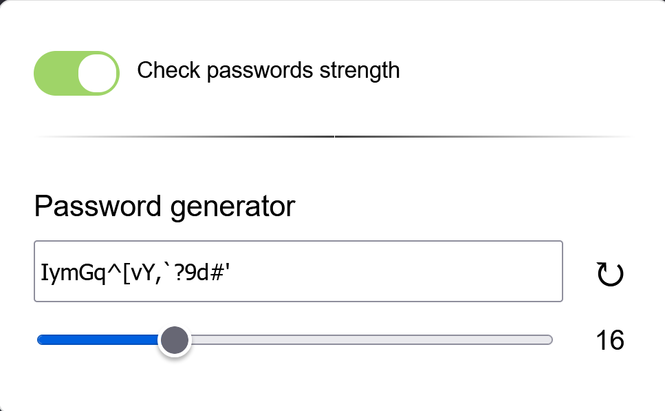
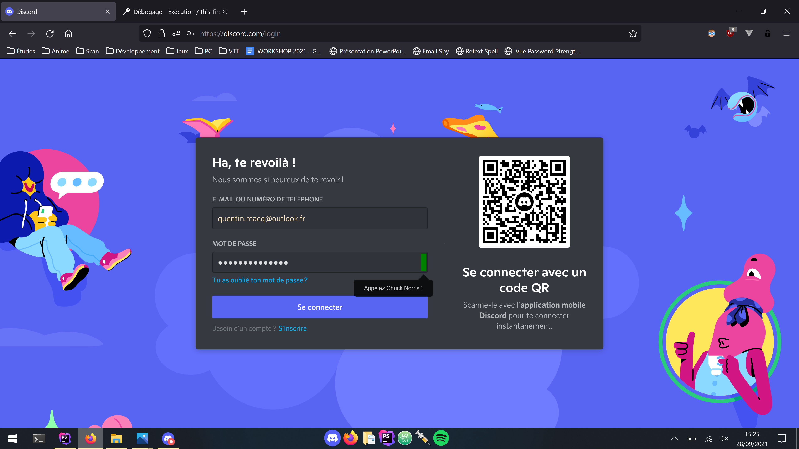

# PasswordChecker

Extension for checking passwords strength and generating passwords.

Supports multiple `password` inputs on a single page.

## Interface générale

## Affichage
### Mot de passe faible

### Mot de passe fort

